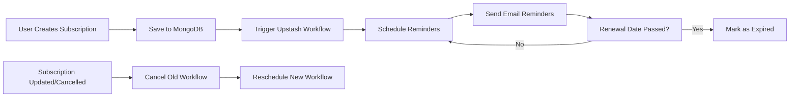

<div align="center">
  
  
  
  
  
  <h1>💰 Subscription Tracker API</h1>
  <p><strong>Never miss a recurring payment again</strong></p>
  <p>A production-ready subscription management system with automated reminders, role-based access control, and workflow automation.</p>
  
  [](LICENSE)
  [](http://makeapullrequest.com)
</div>

---
## 📑 Table of Contents

- [✨ Features](#-features)
- [🛠️ Tech Stack](#️-tech-stack)
- [📁 Project Structure](#-project-structure)
- [🚀 Quick Start](#-quick-start)
  - [Prerequisites](#prerequisites)
  - [Installation](#installation)
  - [Environment Variables](#environment-variables)
- [📚 API Documentation](#-api-documentation)
  - [🔐 Authentication Endpoints](#-authentication-endpoints)
  - [👤 User Endpoints](#-user-endpoints)
  - [📋 Subscription Endpoints](#-subscription-endpoints)
  - [🔄 Workflow Endpoints](#-workflow-endpoints)
- [🔄 Reminder Workflow Flow](#-reminder-workflow-flow)
- [📦 Database Schema](#-database-schema)
  - [User Model](#user-model)
  - [Subscription Model](#subscription-model)
- [🤝 Contributing](#-contributing)
- [📄 License](#-license)

---
## ✨ Features

| Feature                    | Description                                                   |
| -------------------------- | ------------------------------------------------------------- |
| 🔐 **Authentication**      | JWT-based secure sign-up, sign-in, and session management     |
| 📋 **Subscription CRUD**   | Create, read, update, delete, and cancel subscriptions        |
| 👑 **Role-Based Access**   | Admin and user roles with different permission levels         |
| ⏰ **Renewal Tracking**    | Auto-calculation of renewal dates and upcoming renewal lookup |
| 🔔 **Smart Reminders**     | Automated email reminders via Upstash Workflow & QStash       |
| 🎯 **Workflow Management** | Automatic rescheduling/cancellation when subscriptions change |
| 🛡️ **Security**            | Rate limiting and request validation with Arcjet              |
| 📧 **Email Notifications** | Nodemailer integration for Gmail/SMTP                         |

---

## 🛠️ Tech Stack

<div align="center">
  
| Category | Technologies |
|----------|--------------|
| **Runtime** | Node.js |
| **Framework** | Express 5 |
| **Database** | MongoDB + Mongoose ODM |
| **Auth** | JWT + bcryptjs |
| **Workflows** | Upstash Workflow & QStash |
| **Email** | Nodemailer |
| **Security** | Arcjet |
| **Date Handling** | dayjs |

</div>

---

## 📁 Project Structure

```

subscription-tracker/
├── 📄 app.js # Application entry point
├── 📁 config/ # Configuration files
├── 📁 controllers/ # Request handlers
├── 📁 database/ # Database connection
├── 📁 middlewares/ # Auth, validation, rate limiting
├── 📁 models/ # Mongoose schemas
├── 📁 routes/ # API endpoints
├── 📁 utils/ # Helper functions
└── 📄 .env.\* # Environment variables

```

---

## 🚀 Quick Start

### Prerequisites

- Node.js (v18 or higher)
- MongoDB Atlas account (or local MongoDB)
- Upstash account (for QStash workflows)
- Gmail account (for email notifications)

### Installation

```bash
# Clone the repository
git clone https://github.com/TheHarmanCodes/subscription-tracker
cd subscription-tracker

# Install dependencies
npm install

# Create environment file
cp .env.development.local.example .env.development.local

# Start development server
node app.js
```

### Environment Variables

Create `.env.development.local` with the following:

```env
# Server
PORT=5500
SERVER_URL=http://localhost:5500

# Database
MONGODB_URI=your_mongodb_connection_string

# Authentication
JWT_SECRET=your_super_secret_jwt_key

# Security
ARCJET_KEY=your_arcjet_api_key

# Upstash QStash
QSTASH_URL=https://qstash.upstash.io
QSTASH_TOKEN=your_qstash_token

# Email (Gmail)
MAIL_USER=your_email@gmail.com
GMAIL_PASS=your_app_specific_password

# Optional
NODE_ENV=development
ADMIN_BOOTSTRAP_SECRET=your_admin_secret
QSTASH_DEV=true
```

---

## 📚 API Documentation

### 🔐 Authentication Endpoints

#### Register New User

```http
POST /api/v1/auth/sign-up
```

<details>
<summary><b>📝 Example Request (Hoppscotch/Postman)</b></summary>

**URL:** `http://localhost:3000/api/v1/auth/sign-up`

**Method:** `POST`

**Headers:**

```
Content-Type: application/json
```

**Body (raw JSON):**

```json
{
  "name": "Jane Doe",
  "email": "jane@example.com",
  "password": "Securepassword@123"
}
```

**Response (201 Created):**

```json
{
  "success": true,
  "message": "User created successfully",
  "data": {
    "user": {
      "_id": "507f1f77bcf86cd799439011",
      "name": "Jane Doe",
      "email": "jane@example.com",
      "role": "user"
    },
    "accessToken": "eyJhbGciOiJIUzI1NiIsInR5cCI6IkpXVCJ9..."
  }
}
```

</details>

#### Login User

```http
POST /api/v1/auth/sign-in
```

<details>
<summary><b>📝 Example Request</b></summary>

**URL:** `http://localhost:3000/api/v1/auth/sign-in`

**Method:** `POST`

**Body:**

```json
{
  "email": "jane@example.com",
  "password": "Securepassword@123"
}
```

**Response (200 OK):**

```json
{
  "success": true,
  "message": "Login successful",
  "data": {
    "user": {
      "_id": "507f1f77bcf86cd799439011",
      "name": "Jane Doe",
      "email": "jane@example.com",
      "role": "user"
    },
    "accessToken": "eyJhbGciOiJIUzI1NiIsInR5cCI6IkpXVCJ9..."
  }
}
```

</details>

#### Logout

```http
POST /api/v1/auth/sign-out
```

<details>
<summary><b>📝 Example Request</b></summary>

**URL:** `http://localhost:3000/api/v1/auth/sign-out`

**Method:** `POST`

**Headers:**

```
Authorization: Bearer <your_access_token>
```

**Response (200 OK):**

```json
{
  "success": true,
  "message": "Logout successful"
}
```

</details>

---

### 👤 User Endpoints

#### Get All Users (Admin Only)

```http
GET /api/v1/users
```

<details>
<summary><b>📝 Example Request</b></summary>

**URL:** `http://localhost:3000/api/v1/users`

**Method:** `GET`

**Headers:**

```
Authorization: Bearer <admin_access_token>
```

**Response (200 OK):**

```json
{
  "success": true,
  "data": [
    {
      "_id": "507f1f77bcf86cd799439011",
      "name": "John Doe",
      "email": "john@example.com",
      "role": "user"
    },
    {
      "_id": "507f1f77bcf86cd799439012",
      "name": "Jane Smith",
      "email": "jane@example.com",
      "role": "admin"
    }
  ]
}
```

</details>

#### Get User by ID

```http
GET /api/v1/users/:id
```

<details>
<summary><b>📝 Example Request</b></summary>

**URL:** `http://localhost:3000/api/v1/users/507f1f77bcf86cd799439011`

**Method:** `GET`

**Headers:**

```
Authorization: Bearer <access_token>
```

**Response (200 OK):**

```json
{
  "success": true,
  "data": {
    "_id": "507f1f77bcf86cd799439011",
    "name": "John Doe",
    "email": "john@example.com",
    "role": "user"
  }
}
```

</details>

---

### 📋 Subscription Endpoints

#### Create Subscription

```http
POST /api/v1/subscriptions
```

<details>
<summary><b>📝 Example Request</b></summary>

**URL:** `http://localhost:3000/api/v1/subscriptions`

**Method:** `POST`

**Headers:**

```
Authorization: Bearer <access_token>
Content-Type: application/json
```

**Body:**

```json
{
  "name": "Netflix Premium",
  "price": 15.99,
  "currency": "USD",
  "frequency": "monthly",
  "category": "entertainment",
  "paymentMethod": "Credit Card",
  "startDate": "2024-01-15",
  "renewalDate": "2024-02-15"
}
```

**Response (201 Created):**

```json
{
  "success": true,
  "message": "Subscription created successfully",
  "data": {
    "_id": "507f1f77bcf86cd799439013",
    "name": "Netflix Premium",
    "price": 15.99,
    "currency": "USD",
    "frequency": "monthly",
    "category": "entertainment",
    "paymentMethod": "Credit Card",
    "status": "active",
    "startDate": "2024-01-15T00:00:00.000Z",
    "renewalDate": "2024-02-15T00:00:00.000Z",
    "user": "507f1f77bcf86cd799439011",
    "workflowRunId": "wf_abc123",
    "createdAt": "2024-01-15T10:30:00.000Z"
  }
}
```

</details>

#### Get User's Subscriptions

```http
GET /api/v1/subscriptions/user/:id
```

<details>
<summary><b>📝 Example Request</b></summary>

**URL:** `http://localhost:3000/api/v1/subscriptions/user/507f1f77bcf86cd799439011`

**Method:** `GET`

**Headers:**

```
Authorization: Bearer <access_token>
```

**Response (200 OK):**

```json
{
  "success": true,
  "data": [
    {
      "_id": "507f1f77bcf86cd799439013",
      "name": "Netflix Premium",
      "price": 15.99,
      "currency": "USD",
      "frequency": "monthly",
      "status": "active",
      "renewalDate": "2024-02-15T00:00:00.000Z"
    },
    {
      "_id": "507f1f77bcf86cd799439014",
      "name": "Spotify Family",
      "price": 12.99,
      "currency": "USD",
      "frequency": "monthly",
      "status": "active",
      "renewalDate": "2024-02-20T00:00:00.000Z"
    }
  ]
}
```

</details>

#### Get All Subscriptions (Admin)

```http
GET /api/v1/subscriptions
```

<details>
<summary><b>📝 Example Request</b></summary>

**URL:** `http://localhost:3000/api/v1/subscriptions`

**Method:** `GET`

**Headers:**

```
Authorization: Bearer <admin_access_token>
```

**Response (200 OK):**

```json
{
  "success": true,
  "data": [
    {
      "_id": "507f1f77bcf86cd799439013",
      "name": "Netflix Premium",
      "user": {
        "name": "John Doe",
        "email": "john@example.com"
      },
      "price": 15.99,
      "status": "active"
    }
  ]
}
```

</details>

#### Get Single Subscription

```http
GET /api/v1/subscriptions/:id
```

<details>
<summary><b>📝 Example Request</b></summary>

**URL:** `http://localhost:3000/api/v1/subscriptions/507f1f77bcf86cd799439013`

**Method:** `GET`

**Headers:**

```
Authorization: Bearer <access_token>
```

**Response (200 OK):**

```json
{
  "success": true,
  "data": {
    "_id": "507f1f77bcf86cd799439013",
    "name": "Netflix Premium",
    "price": 15.99,
    "currency": "USD",
    "frequency": "monthly",
    "category": "entertainment",
    "paymentMethod": "Credit Card",
    "status": "active",
    "startDate": "2024-01-15T00:00:00.000Z",
    "renewalDate": "2024-02-15T00:00:00.000Z",
    "user": "507f1f77bcf86cd799439011"
  }
}
```

</details>

#### Update Subscription

```http
PUT /api/v1/subscriptions/:id
```

<details>
<summary><b>📝 Example Request</b></summary>

**URL:** `http://localhost:3000/api/v1/subscriptions/507f1f77bcf86cd799439013`

**Method:** `PUT`

**Headers:**

```
Authorization: Bearer <access_token>
Content-Type: application/json
```

**Body:**

```json
{
  "name": "Netflix Ultra HD",
  "price": 19.99,
  "paymentMethod": "PayPal"
}
```

**Response (200 OK):**

```json
{
  "success": true,
  "message": "Subscription updated successfully",
  "data": {
    "_id": "507f1f77bcf86cd799439013",
    "name": "Netflix Ultra HD",
    "price": 19.99,
    "paymentMethod": "PayPal"
  }
}
```

</details>

#### Cancel Subscription

```http
PATCH /api/v1/subscriptions/:id/cancel
```

<details>
<summary><b>📝 Example Request</b></summary>

**URL:** `http://localhost:3000/api/v1/subscriptions/507f1f77bcf86cd799439013/cancel`

**Method:** `PATCH`

**Headers:**

```
Authorization: Bearer <access_token>
```

**Response (200 OK):**

```json
{
  "success": true,
  "message": "Subscription cancelled successfully",
  "data": {
    "_id": "507f1f77bcf86cd799439013",
    "status": "cancelled"
  }
}
```

</details>

#### Delete Subscription

```http
DELETE /api/v1/subscriptions/:id
```

<details>
<summary><b>📝 Example Request</b></summary>

**URL:** `http://localhost:3000/api/v1/subscriptions/507f1f77bcf86cd799439013`

**Method:** `DELETE`

**Headers:**

```
Authorization: Bearer <access_token>
```

**Response (200 OK):**

```json
{
  "success": true,
  "message": "Subscription deleted successfully"
}
```

</details>

#### Get Upcoming Renewals

```http
GET /api/v1/subscriptions/upcoming-renewals?days=30
```

<details>
<summary><b>📝 Example Request</b></summary>

**URL:** `http://localhost:3000/api/v1/subscriptions/upcoming-renewals?days=30`

**Method:** `GET`

**Headers:**

```
Authorization: Bearer <access_token>
```

**Response (200 OK):**

```json
{
  "success": true,
  "data": {
    "count": 3,
    "subscriptions": [
      {
        "name": "Netflix Premium",
        "renewalDate": "2024-02-15T00:00:00.000Z",
        "price": 15.99,
        "currency": "USD"
      },
      {
        "name": "Spotify Family",
        "renewalDate": "2024-02-20T00:00:00.000Z",
        "price": 12.99,
        "currency": "USD"
      }
    ]
  }
}
```

</details>

---

### 🔄 Workflow Endpoints

#### Trigger Reminder Workflow

```http
POST /api/v1/workflows/subscription/reminder
```

<details>
<summary><b>📝 Example Request</b></summary>

**URL:** `http://localhost:3000/api/v1/workflows/subscription/reminder`

**Method:** `POST`

**Headers:**

```
Authorization: Bearer <access_token>
Content-Type: application/json
```

**Body:**

```json
{
  "subscriptionId": "507f1f77bcf86cd799439013",
  "reminderDays": [7, 3, 1]
}
```

**Response (200 OK):**

```json
{
  "success": true,
  "message": "Reminder workflow triggered",
  "data": {
    "workflowRunId": "wf_xyz789"
  }
}
```

</details>

---

## 🔄 Reminder Workflow Flow



## 📦 Database Schema

### User Model

| Field    | Type   | Constraints                              |
| -------- | ------ | ---------------------------------------- |
| name     | String | Required, min 2, max 50                  |
| email    | String | Required, unique, valid email format     |
| password | String | Required, min 8, not selected by default |
| role     | String | Enum: user/admin, default: user          |

### Subscription Model

| Field         | Type     | Constraints                                                            |
| ------------- | -------- | ---------------------------------------------------------------------- |
| name          | String   | Required, min 2, max 100                                               |
| price         | Number   | Required, min 0                                                        |
| currency      | String   | Enum: EUR/USD/INR, default: INR                                        |
| frequency     | String   | Required: daily/weekly/monthly/yearly                                  |
| category      | String   | Required: sports/news/entertainment/lifestyle/technology/finance/other |
| paymentMethod | String   | Required                                                               |
| status        | String   | Enum: active/inactive/cancelled/expired, default: active               |
| startDate     | Date     | Required, cannot be future                                             |
| renewalDate   | Date     | Must be after startDate (auto-calculated)                              |
| user          | ObjectId | Required, ref to User                                                  |
| workflowRunId | String   | Optional, QStash workflow ID                                           |

---

## 🤝 Contributing

1. Fork the repository
2. Create your feature branch (`git checkout -b feature/amazing-feature`)
3. Commit your changes (`git commit -m 'Add amazing feature'`)
4. Push to branch (`git push origin feature/amazing-feature`)
5. Open a Pull Request

---

## 📄 License

```
Copyright 2026 Subscription Tracker API

Licensed under the Apache License, Version 2.0 (the "License");
you may not use this file except in compliance with the License.
You may obtain a copy of the License at

    http://www.apache.org/licenses/LICENSE-2.0

Unless required by applicable law or agreed to in writing, software
distributed under the License is distributed on an "AS IS" BASIS,
WITHOUT WARRANTIES OR CONDITIONS OF ANY KIND, either express or implied.
See the License for the specific language governing permissions and
limitations under the License.
```

---

<div align="center">
  <b>Built with ❤️ using Node.js, Express & MongoDB</b>
  <br/>
  <sub>Questions? Issues? Feel free to open an <a href="https://github.com/yourusername/subscription-tracker/issues">issue</a></sub>
</div>
